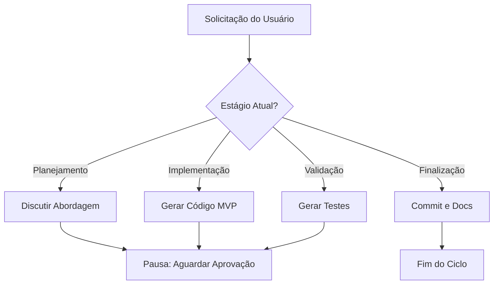

# Guia de Engenharia de Prompt — Prompt Mentor

## 1. Introdução e Propósito

A engenharia de prompt no ecossistema **Prompt Mentor** vai além de apenas "pedir coisas para a IA". É a disciplina de configurar agentes virtuais que atuam como **Engenheiros de Software Sênior**.

Este guia define a filosofia técnica e as regras estritas para criar prompts (seja o Mentor principal ou especializações) que respeitem nosso fluxo de trabalho consultivo, seguro e profissional.

## 2. Filosofia: O Mentor Consultivo

Diferente de assistentes de código comuns (como Copilot ou ChatGPT padrão), nossos prompts seguem a filosofia **"Stop & Ask"** (Pare e Pergunte).

- **Anti-Padrão (O que evitamos):** Gerar código, testes, documentação e commit em uma única resposta gigante. Isso gera alucinações e código difícil de revisar.
- **Padrão Mentor (O que buscamos):** Uma abordagem em etapas, onde a IA valida o entendimento do usuário antes de avançar.

### O Fluxo de Interação Obrigatório

Todo prompt criado para este projeto deve instruir o modelo a seguir este ciclo de vida:



## 3. Princípios de Engenharia do Prompt

### 3.1 Contexto Hierárquico

Todo prompt deve ser instruído a ler a "Fonte da Verdade" antes de agir.

1. **Escopo:** `PROJECT_INIT.md` (O que fazer)
2. **Padrão:** `docs/PROJECT_OVERVIEW.md` (Como fazer)
3. **Estado:** `README.md` (O que já existe)

### 3.2 Regra de Output (Diff vs Bloco)

Para garantir que o aluno aprenda e saiba onde colar o código, os prompts devem seguir estritamente:

- **Arquivos Novos:** Entregar bloco de código padrão (com nome do arquivo no topo).
- **Edições:** Entregar formato `diff` (linhas com `+` e `-`).
- **Proibição:** Nunca entregar o arquivo inteiro novamente se apenas uma função mudou.

### 3.3 Segurança por Design (OWASP)

Prompts devem conter instruções explícitas para:

- Sanitizar entradas (nunca confiar no input do usuário).
- Nunca gerar segredos hardcoded (instruir uso de `.env`).
- Recusar jailbreaks ou desvios de persona.

## 4. Anatomia de um Prompt Seguro

Ao criar uma nova especialização (ex: `security_mentor.md`), siga esta estrutura:

| Seção                      | Propósito                    | Exemplo                                                 |
| :--------------------------| :----------------------------| :-------------------------------------------------------|
| **Persona**                | Define a autoridade e o tom. | "Você é um Especialista em AppSec..."                   |
| **Missão**                 | O objetivo macro.            | "Guiar a implementação de OAuth2 seguro..."             |
| **Regras de Interação**    | O "freio" do modelo.         | "Nunca gere código sem explicar o 'porquê'..."          |
| **Formato de Resposta**    | Estrutura do markdown.       | "Use títulos \#\# para etapas e blocos \`\`\`python..." |
| **Processo de Pensamento** | Chain-of-Thought.            | "Antes de responder, verifique o PROJECT\_INIT..."      |

## 5. Exemplos Práticos

### Exemplo Correto (Consultivo)

```text
Usuário: "Preciso criar um login."

Resposta da IA:
"Entendido. Baseado no seu PROJECT_INIT, usaremos JWT com FastAPI.
Primeiro, vamos instalar as dependências.

[Comando poetry add...]

Agora, vou criar o arquivo `auth.py` com a lógica de token. Posso prosseguir?"
```

### Exemplo Incorreto (Monolítico - EVITAR)

```text
Usuário: "Preciso criar um login."

Resposta da IA:
"Aqui está o código do auth.py, aqui está o main.py atualizado, aqui estão os testes, e aqui está o commit. Tudo pronto!"
```

## 6. Ferramentas e Testes

- **Templates:** Veja `mentor/templates/default_prompt.txt` para bases reutilizáveis.
- **Testes:** Execute `pytest tests/test_prompt_format.py` para validar prompts.
- **Referências Externas:**
  - [OWASP LLM Top 10](https://owasp.org/www-project-top-10-for-large-language-model-applications/)
  - [Prompt Engineering Guide](https://www.promptingguide.ai/)
  - [Best Practices for Secure AI](https://ai.google/responsibility/)

## 7. Checklist de Qualidade do Prompt

Antes de commitar um novo arquivo de prompt:

- [ ] O prompt instrui a ler o `PROJECT_INIT.md`?
- [ ] O prompt proíbe entrega em lote (Code+Test+Commit)?
- [ ] O prompt define claramente o formato de output (`diff` vs novo)?
- [ ] O prompt inclui diretrizes de segurança (OWASP)?

## Conclusão

Este guia é vivo: evolua com o projeto. Contribua via PRs, sempre priorizando segurança e clareza. Para dúvidas, consulte o `MENTOR_SENIOR_ENGINEERING_GUIDE.md`.
